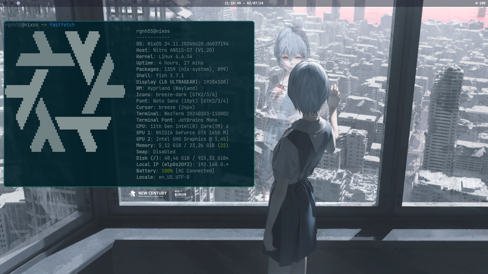

### Useful commands

```
sudo nixos-rebuild switch --flake .
home-manager switch --flake .
nix-collect-garbage -d
sudo nix-collect-garbage -d
nix-shell '<home-manager>' -A install
nix-channel --add https://github.com/nix-community/home-manager/archive/master.tar.gz home-manager
home-manager generations
home-manager expire-generations 2024-07-14 # represents the cut date
nixos-generate-config # /etc/nixos/...
```

```
$ pwd

~/dotfiles-nix
```
